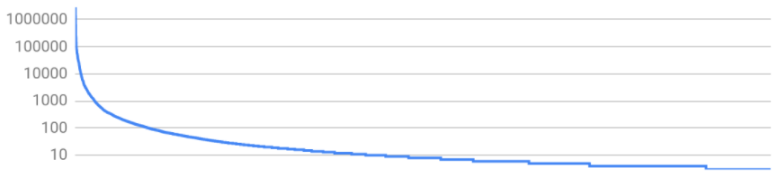

# Embedding Should Require Explicit Opt-in

## A Problem

Documents can embed anything they like via `<frame>` and `<iframe>`, exposing those embedded resources to a number of attacks, ranging from the well-known risks of clickjacking to the less-understood side-channel risks of XSLeaks and Spectre. Developers can mitigate these risks by choosing to limit the ways in which particular resources can be embedded. The `X-Frame-Options` header and CSP's more-granular `frame-ancestors` directive both provide developers with a measure of defense, and are both fairly widely deployed.

That said, as attackers continue to improve their ability to extract cross-origin information in unexpected ways, it becomes increasingly unfortunate that we place the burden of this defense on the victim. It's unfortunate both because it's one more thing for victims to ensure they get right, and because some scenarios make it quite difficult for victims to do the right thing (consider error conditions rejected by a reverse proxy; the application layer might never even have the opportunity to set up a defense).

## A Proposal

Documents which intend to be embedded cross-origin ought to positively opt-into that state. Documents which do not explicitly opt-in to being embedded in a particular context will be blocked unless all of their ancestors are same-origin (similar conceptually to the behavior of `X-Frame-Options: SAMEORIGIN`). This shifts both the burden and the risk to those sites which actually wish to be embeddable; developers who take no action will be safe by default.

Embeddable documents can opt-into the embedding by sending either an appropriate `X-Frame-Options` header, or a `Content-Security-Policy` header that asserts a frame-ancestors directive.

This change could be a relatively straightforward addition to the [XFO algorithm](https://html.spec.whatwg.org/#check-a-navigation-response's-adherence-to-x-frame-options) in HTML. Something along the lines of the following would suffice (though it may make sense to split it out into a distinct check for clarity):

> 6. If `xFrameOptions` is empty, append "sameorigin" to `xFrameOptions`.
>
>    Note: Step 2 already verifies that no `frame-ancestors` directive is present, so it's safe to set a default value here when no `X-Frame-Options` value is present.

## FAQ

### Is this change deployable?

In Oct. 2020, ~92% of embedded documents did not assert either `X-Frame-Options` or `frame-ancestors` (according to Chromium's `Security.XFrameOptions` histogram data). We don't have that number tied to page views, but it's reasonable to assume the same order of magnitude. That's a lot of pages. How can we possibly make this change without breaking the internet?

Happily, a small number of origins account for a large number of embedded resources, which means that the outreach we need to do is limited. Skimming through HTTP Archive for cross-origin embeds shows ~50k registrable domains total, but only 400 that are used on more than 1000 pages, and only 4 (`doubleclick.net`, `facebook.com`, `google.com`, and `youtube.com`) that show up on more than 1,000,000 pages. The following chart lays this out more clearly (note the log scale):

It seems reasonable to believe that we can effectively reach out to the embeddees with the widest reach, and encourage them to opt-into being embeddable.

> HTTP Archive query for the data above:
> 
> `SELECT NET.REG_DOMAIN(url) as host, COUNT(*) AS num FROM `httparchive.requests.2020_09_01_desktop` WHERE REGEXP_EXTRACT(payload, r'(?i)sec-fetch-site:\s*([a-z0-9_\/-]+)') != "same-origin" AND REGEXP_EXTRACT(payload, r'(?i)sec-fetch-dest:\s*([a-z0-9_\/-]+)') = "iframe" GROUP BY host ORDER BY num DESC`

### Should we establish some pithy "I'm a widget!" header?

Some widget providers would likely want to make themselves broadly available, setting something like `Content-Security-Policy: frame-ancestors *` on practically every response. This doesn't seem like a substantial burden. Still, given CSP's conceptual complexity, it might be reasonable to create some sort of clear shorthand for the common widgety use case. Perhaps the nonstandard but somewhat common `X-Frame-Options: ALLOWALL` (~0.6% of XFO responses in HTTP Archive) would be a good fit? This would basically require only removing a note from HTML and adding "If `xFrameOptions[0]` is 'allowall', then return true" to the [XFO algorithm](https://html.spec.whatwg.org/#check-a-navigation-response's-adherence-to-x-frame-options).

> HTTP Archive query for the data above:
>
> `SELECT REGEXP_EXTRACT(payload, r'(?i)x-frame-options:\s*([a-z0-9_\/-]+)') AS xfo, COUNT(*) as num FROM `httparchive.requests.2020_09_01_desktop` GROUP BY xfo ORDER BY num DESC`

### Why allow same-origin embedding by default?

It seems reasonable from a deployment perspective to allow the kinds of embedding that can't possibly leak data cross-origin: `frame-ancestors 'self'` should only allow access to data that the embedding page could have anyway (by simply fetching the resource itself and reading its bits).

That said, it does seem reasonable to make embedding always opt-in if we can get away with it. We should look into metrics around same-origin vs. cross-origin embedding to see whether the numbers are small enough to tighten the story (a quick skim through HTTP Archive suggests that this might be the case: there's not a ton of same-origin and/or same-site embedding in relation to cross-origin embedding. Cross-site embeddings account for ~94.7% of nested navigational requests, same-site-but-cross-origin embeddings are ~1.38%, and same-origin ~3.92%).

> HTTP Archive query for the data above:
>
> `SELECT REGEXP_EXTRACT(payload, r'(?i)sec-fetch-site:\s*([a-z0-9_\/-]+)') AS sec_fetch_site, COUNT(*) as num FROM httparchive.requests.2020_09_01_desktop` WHERE REGEXP_EXTRACT(payload, r'(?i)sec-fetch-dest:\s*([a-z0-9_\/-]+)') = "iframe" GROUP BY sec_fetch_site`
